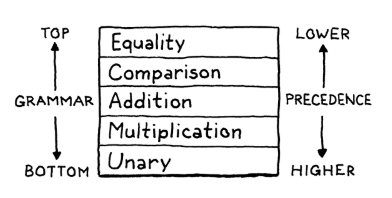
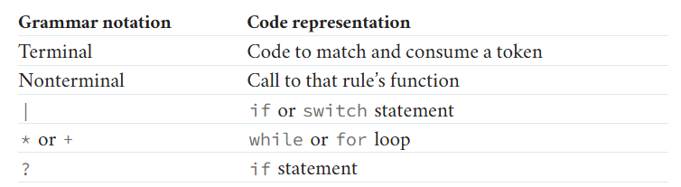

# Writing an Interpreter

## About Interpreters

> In computing, an interpreter is software that executes source code without first compiling it to machine code. [
*Wikipedia*](https://en.wikipedia.org/wiki/Interpreter_(computing))

Interpreters are used many programming languages, a few example would be Python, JavaScript, Ruby or PHP. Why are
we doing that? Because Compilers need time to compile while interpreters can start executing immediately. When not
compiling your program you will lose some performance, So even languages like JavaScript do some compiling sometimes.

How do Interpreters work? Intepreters usually have a three-step process:

* Lexing
* Parsing
* Interpreting / Evaluating

In the Lexing phase Code is split into tokens. These Tokens are then parsed into an AST (Asymmetrical Syntax Tree). This
tree is given to the interpreter which is able to execute these expression.

## Lexing

Lexing is the first step an interpreter takes. When lexing, the program takes the given grammar and converts it into
tokens. You basically prepare the grammar for the parser. In the end you have a list of tokens that can be interpreted
by the interpreter. In my case the Lexer returns a list of Tokens.

## Recursive Descent Parser

A recursive descent parser is a simple but powerful way to parse grammar.
This type of parser, parses top down as it starts from the topmost rules and keeps going to the last.
So a recursive descent parser translates grammar into directly into code.

<figure>
  
  <figcaption>From top to bottom different grammar rules.</figcaption>
</figure>   

Grammar rules are defined in the [Backus-Naur form](https://en.wikipedia.org/wiki/Backus%E2%80%93Naur_form) (BNF):

```
expression     → equality ;
equality       → comparison ( ( "!=" | "==" ) comparison )* ;
comparison     → term ( ( ">" | ">=" | "<" | "<=" ) term )* ;
term           → factor ( ( "-" | "+" ) factor )* ;
factor         → unary ( ( "/" | "*" ) unary )* ;
unary          → ( "!" | "-" ) unary
               | primary ;
primary        → NUMBER | STRING | "true" | "false" | "nil"
               | "(" expression ")" ;
```

The different grammar used in the rules can be translated to:


<figure>
  
  <figcaption>Terminal and Non-Terminal are different types of grammar. A Terminal is a fixed expression like a Number or a String. A
Non-Terminal will be replaced e.g. Variables for example.</figcaption>
</figure>

## Interpreting

In the final phase, the interpreting you evaluate the expression which has been successfully parsed into an AST. It is
possible to do this in many different ways. In the end you have a single value that, in this case, can be printed to the
console.

## Final Product

The final product is an interpreter that is, able to lex arithmetic operations, parse and execute them. In the end
they're printed to the console. The program is not able to handle string values, variables or anything else.

## sources

Wikipedia:

* [03.10.2025, about Interpreters](https://en.wikipedia.org/wiki/Interpreter_(computing))

Crafting Interpreters

* [03.10.2025, Lexing](https://craftinginterpreters.com/representing-code.html)
* [03.10.2025, Parsing](https://craftinginterpreters.com/parsing-expressions.html)
* [03.10.2025, Interpreting](https://craftinginterpreters.com/evaluating-expressions.html)

Toptal Tutorial

* [03.10.2025, Writing an Interpreter (Tutorial)](https://www.toptal.com/scala/writing-an-interpreter)
* [03.10.2025, Writing an Interpreter (Code)](https://github.com/sake92/writing-an-interpreter)

Youtube:

* [03.10.2025, Recursive Descent Parsing Tutorial](https://youtu.be/SToUyjAsaFk?si=bNT6jCuzvUp2ljdE)
